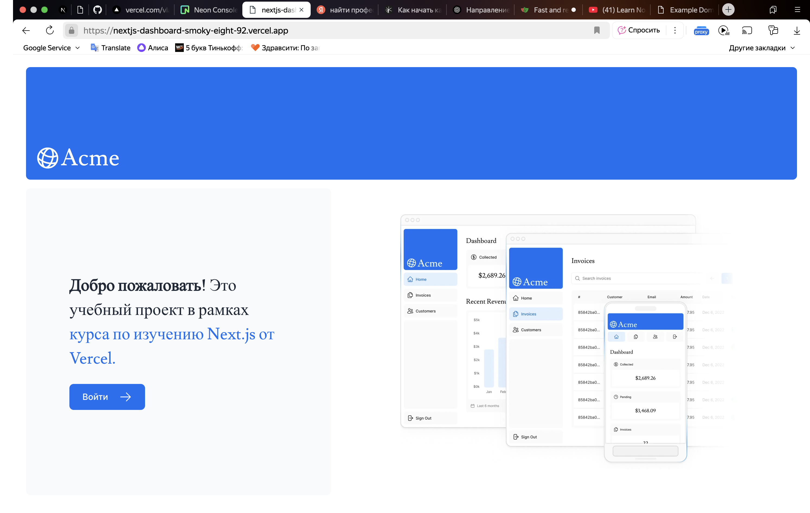
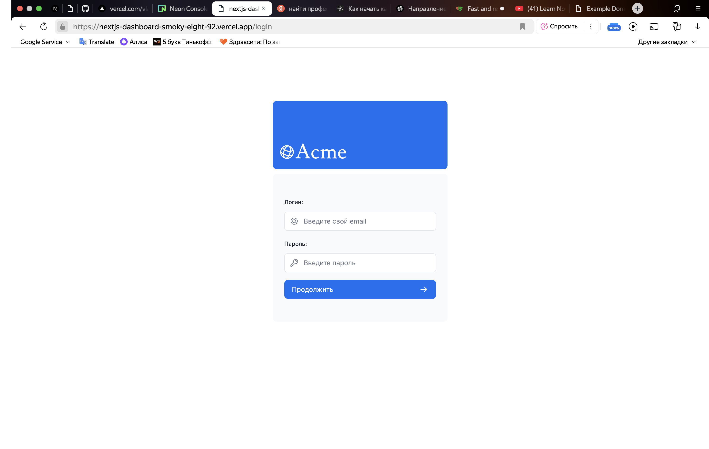
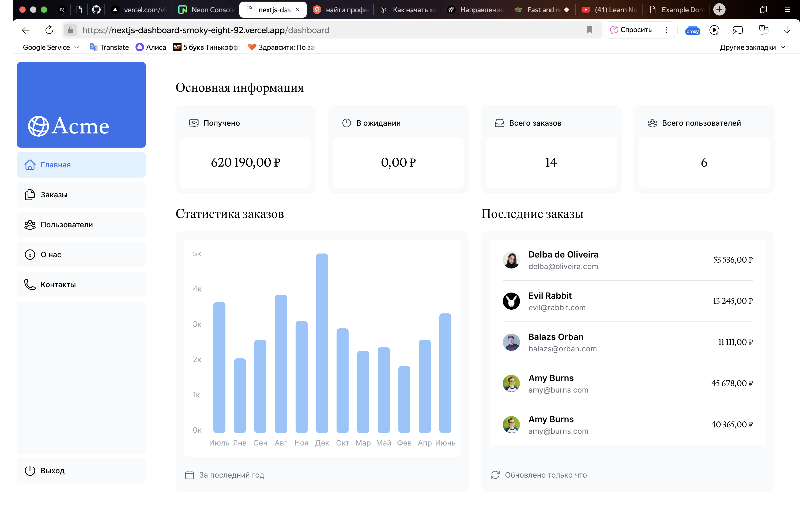
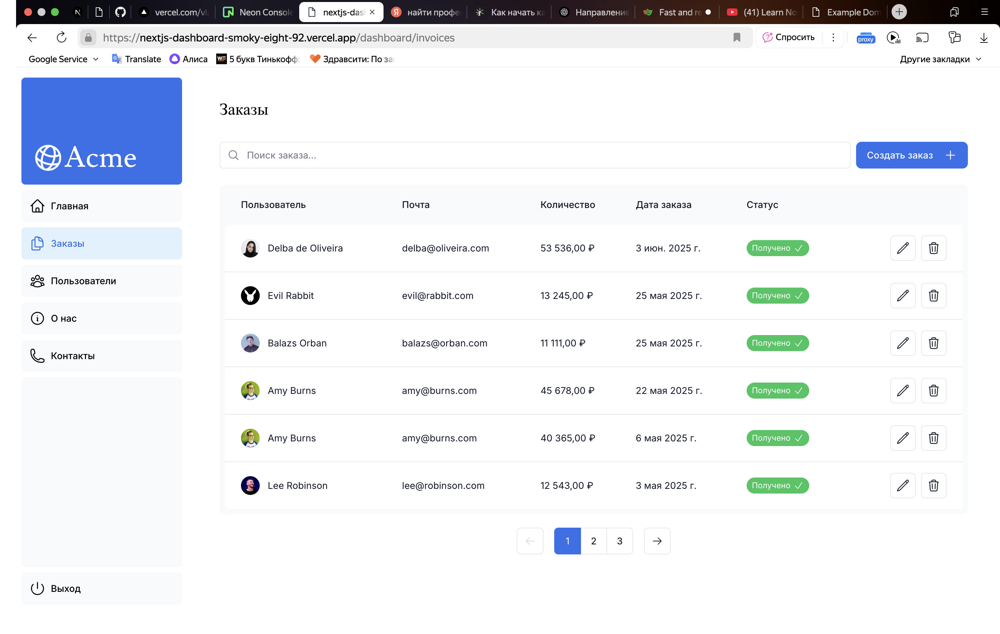
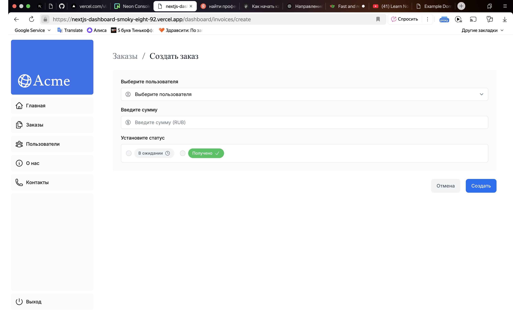
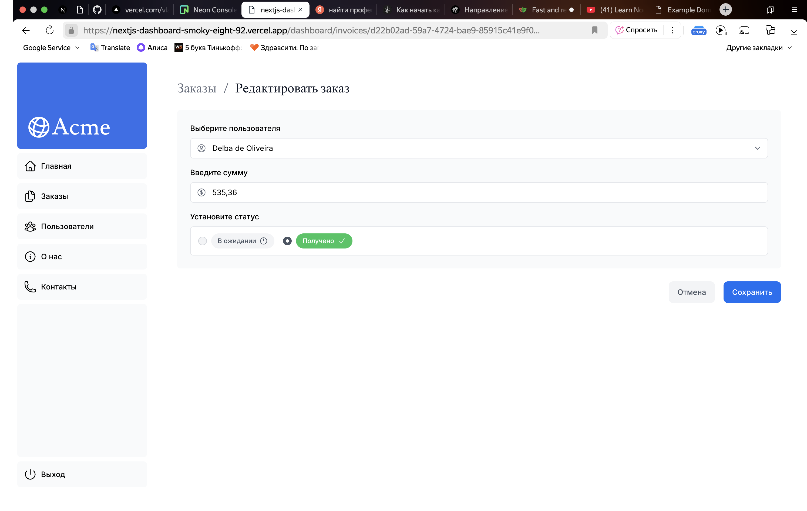

# 📊 Next.js Dashboard

Интерактивная панель администратора, созданная с использованием **Next.js**, **TypeScript**, **Tailwind CSS** и **shadcn/ui**. Проект разработан в учебных целях для демонстрации современных практик фронтенд-разработки, компонентного подхода и работы с UI-библиотеками.

---

## 🚀 Технологии

- [Next.js 14 (App Router)](https://nextjs.org/)
- [TypeScript](https://www.typescriptlang.org/)
- [Tailwind CSS](https://tailwindcss.com/)
- [shadcn/ui](https://ui.shadcn.com/)
- [Lucide Icons](https://lucide.dev/)
- [Radix UI](https://www.radix-ui.com/)
- [React Hook Form](https://react-hook-form.com/)
- [Zod](https://zod.dev/) — валидация схем

---

## ✨ Возможности

- ✅ Современная структура проекта на Next.js App Router
- 🎨 Использование Tailwind + shadcn/ui для красивого и отзывчивого интерфейса
- 🧩 Компонентный подход
- 🧪 Настроенные формы с валидацией через React Hook Form + Zod
- 🌗 Поддержка тёмной темы

---

## 📷 Скриншоты

| Стартовая страница | Форма входа | Главная страница | Страница заказов | Создание заказов | Редактор заказа |
|----------------|------------------|------------------|------------------|------------------|------------------|
|  |  |  |  |  | 

> 📌 Скриншоты можно заменить своими (папка `/public`), если ещё не добавлены

---

## ⚙️ Установка и запуск

```bash
# Клонируйте репозиторий
git clone https://github.com/p4sdev/nextjs-dashboard.git
cd nextjs-dashboard

# Установите зависимости
npm install

# Запустите локальный сервер
npm run dev
